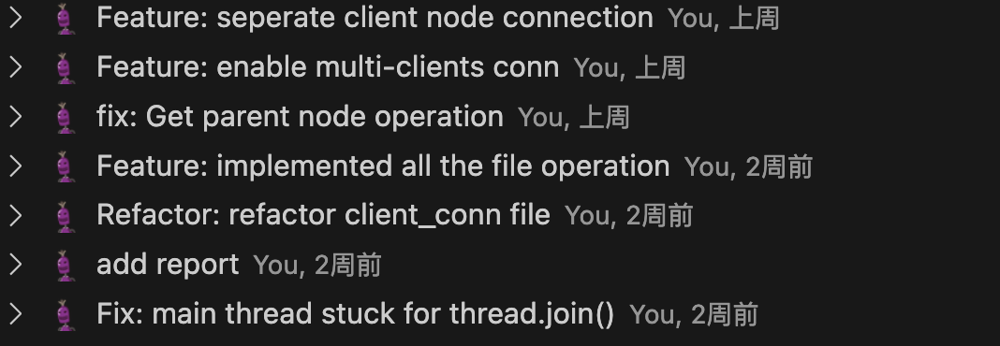
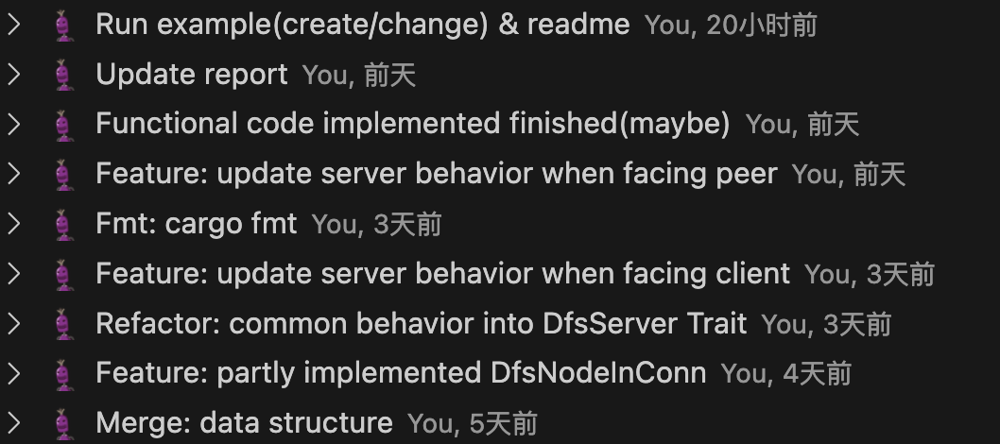

## 吴宸昊开发日志

2023.10.15-2023.10.23
基于rust标准库实现了一个服务端master，在主线程中负责监听所有tcp连接，监听到连接后创建子线程负责处理文件的读写操作。

2023.10.23-2023.11.7
实现与ArceOS具体的收发包处理逻辑，将客户端传来的网络请求转化为本地文件读写操作。
初步实现了只有一个服务器，可以接收多个客户端连接的网络文件系统。

中期后目标，设计完整的分布式文件系统体系结构，完善代码逻辑并测试。

2023.11.7-2023.11.14
实现支持多个服务器与多个客户端的分布式文件系统体系结构。
2023.11.14-2023.11.21
完善分布式文件系统完整读写逻辑。

