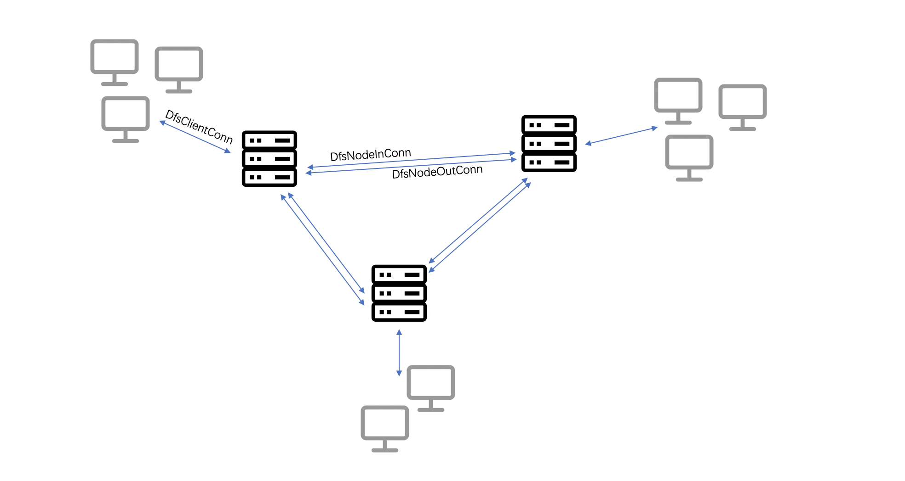

# 基于ArceOS的分布式文件系统

## 架构设计



- 动态支持多台服务器的加入，每台服务器支持多个客户端链接。
- 新服务器加入集群时，会与已经存在的服务器建立链接，并监听其他客户端的接入。
- 每台服务器上保存有文件名索引，用于指示文件存在的服务器编号，新服务器接入集群时，会从0号服务器获得完整的文件索引。
- 收到来自客户端的文件操作时，服务器会查找文件所处的服务器，如果存在于本地则直接进行本地操作；如果存在其他服务器则将操作转交给其他服务器。

## 数据结构设计

``` rust
pub struct DfsClientConn {
    node_id: NodeID,
    root_path: PathBuf,
    conn: TcpStream,
    peers: Arc<DashMap<NodeID, Arc<MessageQueue>>>,
    file_index: Arc<DashMap<String, NodeID>>,
}
```

这个结构表示客户端到服务器的链接，在客户端处理线程中，客户端监听来自conn的数据；根据file_index中指示的文件位置，进行本地文件操作或将文件操作转发给peers中的消息队列，这个消息队列将被服务器链接线程读取。

``` rust
pub struct DfsNodeInConn {
    node_id: NodeID,
    root_path: PathBuf,
    conn: TcpStream,
    peers: Arc<DashMap<NodeID, Arc<MessageQueue>>>,
    file_index: Arc<DashMap<String, NodeID>>,
}
```

这个结构表示其他服务器到自己的链接，可以发现这个结构体与客户端到服务端的链接一样；因为本质上收到其他来自与其他服务器的文件操作请求时，其他服务器也相当于一种客户端：唯一区别在于此结构体收到的文件请求是一定可以在本地进行的，省去了查询索引这一步的操作。

``` rust
pub struct DfsNodeOutConn {
    conn: TcpStream,
    message_queue: Arc<MessageQueue>,
}
```

这个结构表示自身到其他服务器的链接，包含一个消息队列与Tcp链接本身；在这个链接处理线程中，服务器会不断监听消息队列(这个消息队列被不同线程共享，表示其他客户端链接线程需要转交处理的文件操作)；每发现一个需要转发的链接，服务器会往对应连接中写入请求并等待对方的响应。

## 文件索引维护

决定文件操作是否被转发的关键就是通过文建索引判断文件是否存在本地，如果不存在则会转交给对应的服务器。
文件索引的维护设计以下几种情况：

- 加入服务器集群：从0号节点获取完整服务器索引；
- 创建文件：往文件树索引中插入索引条目，同时通知其他所有服务器；
- 删除文件：删除文件树索引中索引条目，同时通知其他所有服务器；
- 重命名文件：更新文件树索引，同时通知其他所有服务器；

## 运行方法

- 运行服务器：/tools/dfs-host下

``` shell
cargo run -- 0(从0开始动态接入)
```

- 运行ArceOS：根目录下

``` shell
make run APP=apps/fs/shell FEATURES=alloc,paging,fs,net,multitask BLK=y NET=y LOG=debug ARCH=riscv64 NET_PORT=(填入预期运行的端口号)
```
