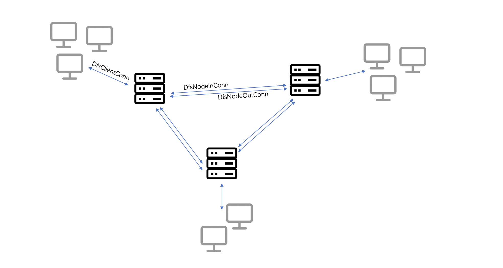
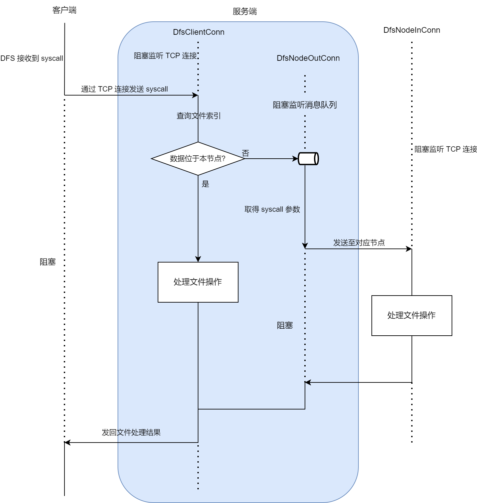

# 基于 ArceOS 的分布式文件系统设计

吴宸昊, 周智

## 内容

本项目实现了一个分布式文件系统 (下称 DFS), 其客户端运行在 ArceOS 内核中的文件系统层, 而其服务端可运行于 ArceOS 或是主流操作系统上, 二者之间通过网络通信. 更具体地, 本项目实现了以下内容:

1. 运行于 ArceOS 虚拟文件系统层的客户端, 位于 `modules/axfs/src/fs/distfs`; 其功能可在编译时通过 `distfs` 这一 feature 控制是否启用.
1. 可编译到 ArceOS 或是主流操作系统的服务器端, 位于 `tools/dfs-host`; 其编译目标通过 `axstd` 这一 feature 控制.
1. 为支持 DFS 的挂载, 对原 ArceOS 组织文件系统挂载点的方式做出了一定修改, 并实现了 `mount`/`umount` 这一对 syscall.

## 客户端

其核心位于 `axfs::fs::distfs::DistFileSystem`, 实现为一个可挂载至 ArceOS 的子文件系统, 与 `fatfs`/`tempfs` 等类似. ArceOS 对于挂载点的定义为:

```rust
struct MountPoint {
    path: compact_str::CompactString,
    fs: Arc<dyn VfsOps>,
}
```

对于涉及文件操作的 syscall, 其操作路径如果位于某挂载点下则会被转交给对应的 `fs` 进行处理, 否则由根文件系统进行处理; 运行时一个客户端实例对应着一个 `MountPoint`, 客户端 `DistFileSystem` 本身实现了 `VfsOps` 从而可被挂载. `DistFileSystem` 中储存到根节点的引用, 其文件操作在根节点 (类型为 `axfs::fs::distfs::wrapper::NodeWrapper`) 中实现. 在挂载时, `mount` 这一 syscall 会给出挂载点的本地路径和服务器的网络位置 (由一个 `SocketAddr` 定义), 并储存和服务器的 TCP 连接. `mount` 的方式类似:

```shell
mount 127.0.0.1:9000 /dist distfs
```

关于这点后有详述.

客户端本身为无状态的, 不保存文件系统的数据或是索引, 从而可以随意 `mount`/`umount` 而不会对分布式系统的状态有任何影响. 在 `mount` 一个 DFS 之前, 需要先确保其连接至的网络位置可用并运行着一个 DFS 服务端.

客户端实现默认底层的 TCP 连接是可靠的, TCP socket 上的网络请求失败时会将其作为文件系统错误返回, 用户需要自行处理; 超时理论上可作为错误被处理, 但目前实现中未考虑.

### `NodeWrapper`

其为 DFS 客户端中所使用的文件树节点类型, 定义为:

```rust
pub struct NodeWrapper {
    data: Weak<SharedData>,
    relpath: CompactString,
}
```

其实现了 `VfsNodeOps`, 从而在操作系统看起来可和一般文件系统树中的节点无异地操作. 其中保存的 `relpath` 为相对于 DFS 根节点的路径, 在收到文件系统相关的 syscall 也即收到 `VfsNodeOps` 中定义的操作时, 其将操作和路径通过 TCP socket 发送给服务器, 并阻塞地等待服务器回复后检查返回值. 以 `read_at` 的实现为例:

```rust
fn read_at(&self, offset: u64, buf: &mut [u8]) -> VfsResult<usize> {
    log::debug!("distfs: read_at");
    let length = buf.len() as _;
    let data = self.try_get_data()?;
    let conn = &data.conn;
    send_fsop(
        Request::new(&self.relpath, request::Read { length, offset }.into()),
        &conn,
    )?;
    let stat: Response<u64> = recv_fsop(&conn)?;

    // If error code is returned, early exit;
    // otherwise recv content of file.
    let size = stat.map_code()? as usize;
    if size == 0 {
        return Ok(0);
    }
    let ret = conn.recv(buf)?;
    match size.cmp(&ret) {
        core::cmp::Ordering::Less => panic!(
            "recved {} bytes while expecting {} bytes, which implies severe logical bug",
            ret, size
        ),
        core::cmp::Ordering::Equal => Ok(size),
        core::cmp::Ordering::Greater => ax_err!(
            UnexpectedEof,
            format_args!("recved {} bytes while expecting {} bytes", ret, size)
        ),
    }
}
```

其在 `send_fsop` 将所需操作发至服务端后通过 `recv_fsop` 等待服务端返回操作状态, 并在之后接受读取的文件内容.

## 服务端

位于 `tools/dfs-host`, 其为分布式文件系统的核心. 架构上, 每个服务端允许多个客户端的连入, 并同时与多个分布式服务端连接, 如图所示:



每个分布式服务端内保存完整的文件系统索引与部分文件系统数据, 索引中包含文件数据所处在的节点信息. 在收到请求后, 如数据处在本节点, 则直接操作本节点上的文件数据; 如不处于, 则将请求转交到保有数据的对应节点进行处理.

### 程序形式

在运行于 ArceOS 上时, 类似其它运行于 ArceOS 上的应用, 服务端和 ArceOS 内核一并打包为一个可引导镜像; 在运行于其它操作系统上时, 服务端编译为目标上的一个可执行文件. 在编译到 ArceOS 时, 服务端采用 `axstd` 来替换其它操作系统上的 `std`; 二者之间 api 上的不一致通过在 `dfs_host::utils(_axstd)` 中根据启用 `axstd` feature 与否定义/导出相应的 api 实现, 以一种类似 polyfill 的方式抹平.

### 连接与请求处理

实现上, 服务端保存着由客户端发起的长连接 (图中的 `DfsClientConn`) 与分布式系统中其它节点加入时发起的双向长连接 (图中的 `DfsNodeInConn` 和 `DfsNodeOutConn`). 为保持可用性, 连接之间是并发的, 每个连接对应着节点上的一个处理线程, 线程之间通过消息队列进行通信. 对于客户端发起的一个请求, 其处理流程如下:



客户端在收到 syscall 之后通过 TCP 连接发送请求, 服务端中的处理线程 `DfsClientConn` 收到后通过查询文件索引得知文件所处在的节点, 如处在本节点则直接处理文件操作并通过连接返回; 如不处在本节点则通过持有对应节点长连接的 `DfsNodeOutConn` 发送请求至对应的节点 `DfsNodeInConn` 线程处理. 实现上 `DfsNodeOutConn` 持有一个并发消息队列以处理来自多个客户端 (也就是来自多个 `DfsClientConn` 线程) 的请求. 处理文件操作的方式为调用服务端所运行于的操作系统的文件 api, 通过类似 bind mount 的方式处理数据.

`tools/dfs-host/src/host.rs` 实现了初始化监听来自其它节点和客户端的连接的逻辑, `DfsClientConn` 实现于 `tools/dfs-host/src/client_conn.rs`, `DfsNodeInConn`/`DfsNodeOutConn` 实现于 `tools/dfs-host/src/node_conn.rs`. 各连接之间数据的序列化/反序列化使用 `bincode` 处理.

### 一致性

DFS 保证对于某个客户端看来, 文件的数据读写有着顺序一致性; 也即所有节点及节点内的并发操作同意它们之间的某种未指定的读写顺序, 而对于某个客户端而言, 其读写操作有着按照发起时间确定的顺序. 同时, 每个客户端发起的每个 syscall 都应该造成原子的结果. 这由以下几点所保证:

- 任一文件数据唯一储存在一个服务端节点上, 这降低了并发性和分区可用性, 但简化了文件数据的一致性问题: 只要节点内部对文件数据的操作保证顺序一致性, 则分布式系统保证对文件数据的顺序一致性.

- 一般地讲, 要在并发的情况下保证在节点内对文件数据的操作为顺序一致的, 需要顺序化在文件数据上的写操作, 也就是让文件数据被读写锁保护; 由于 Linux 上常见的文件系统本身保证在并发情况下对文件数据的顺序一致性, 在客户端运行于 Linux 上时无需额外加锁, 直接并发地使用文件系统 api 即可.

实现中对文件的索引仅保证一种稍强于最终一致性的一致性. 操作文件索引的操作可能没有效果, 并且系统中可能短暂存在文件索引的不一致; 但在单个节点内文件的索引上不存在并发冲突, 整个系统经过一定时间后 (一个文件数据操作时间内没有对索引的写操作), 系统的索引达到某种一致状态.

## 支持性工作

这部分工作为实现 DFS 过程中对 ArceOS 进行的一些可用性改进, 可 cherry-pick 后无需多少修改合并至主线中.

- 修改了原 ArceOS 中挂载点的实现方式.

  原 ArceOS 中的 `MountPoint` 实现为:

  ```rust
  struct MountPoint {
      path: &'static str,
      fs: Arc<dyn VfsOps>,
  }
  ```

  无法进行动态挂载, 只能在编译期设置好挂载点, 在 ArceOS 初始化时挂在 `/sys` 和 `/proc`. 修改后其定义见上, 并在 `axfs::root`/`axfs::api::mount`/`arceos_api::imp::fs::{ax_mount, ax_umount}` 中实现/完善了 `mount`/`umount` 这一对 api, 支持类似 Linux 的 `mount` 调用:

  ```shell
  mount <mount from resource> <mount to absolute path> <fstype>
  umount <mounted absolute path>
  ```

- 用 patch 过的 [`noline`](https://github.com/Sssssaltyfish/noline) 重新实现了 `apps/fs/shell` 的主逻辑.

  优化了 shell 应用的使用体验, 使之支持更多键盘快捷键及持久化的命令历史记录. patch 位于 `patches/noline`.

- 修复了 `Makefile` 会在编译完成之前就开始执行 `qemu` 的问题, 并内置了 `OpenSBI` 的 binary 以方便在老版本的 `riscv-qemu` 上执行 ArceOS.

- 为一些库添加了 ArceOS 支持, 位于 `patches`.
